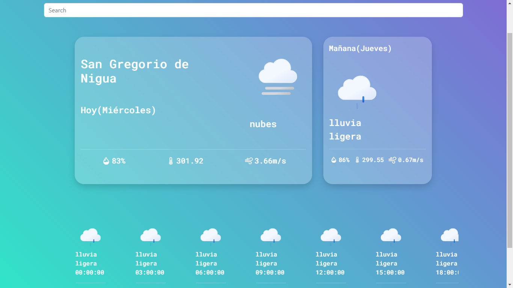

# weather-app
### url: <a href="https://main--timely-brigadeiros-105333.netlify.app/">weather-app</a>

create 🔐.env.local🔐

<ul>
  <li>VITE_API_KEY_OPEWEATHER: "my Secret key"</li>
  <li>VITE_MAPBOX_TOKEN: "my secret key"</li>
</ul>

